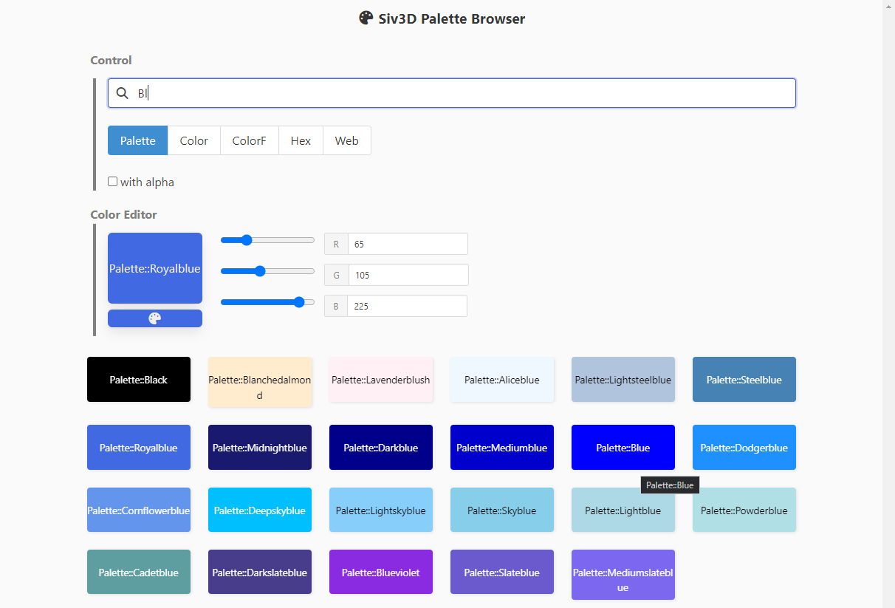

# Siv3D Palette Browser

# 概要

[OpenSiv3D](https://github.com/Siv3D/OpenSiv3D) の [Palette](https://github.com/Siv3D/OpenSiv3D/blob/main/Siv3D/include/Siv3D/Palette.hpp#L23) で定義されている色を見ながらクリックしてコピペするためのツール
