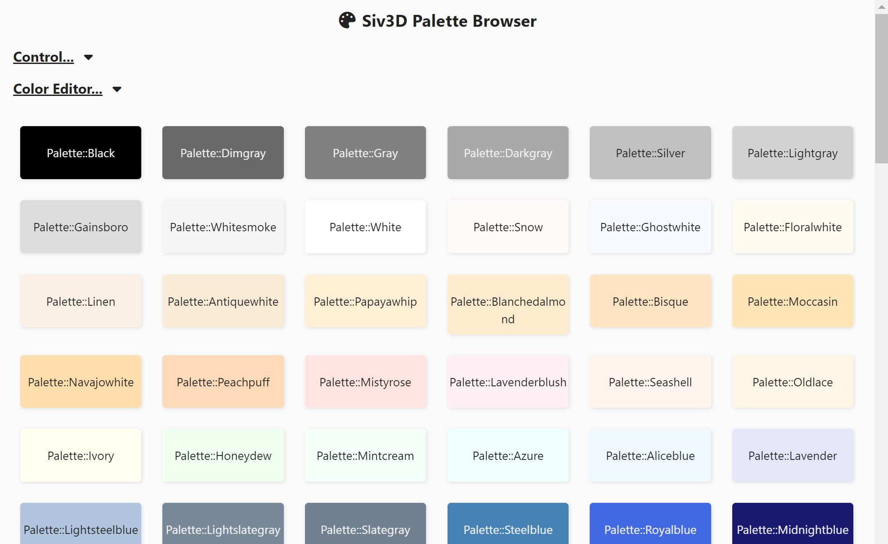
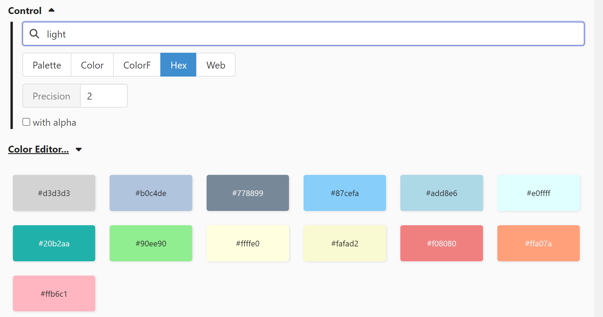
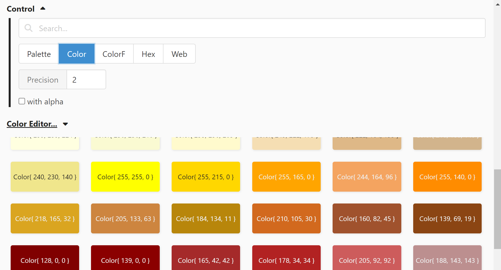
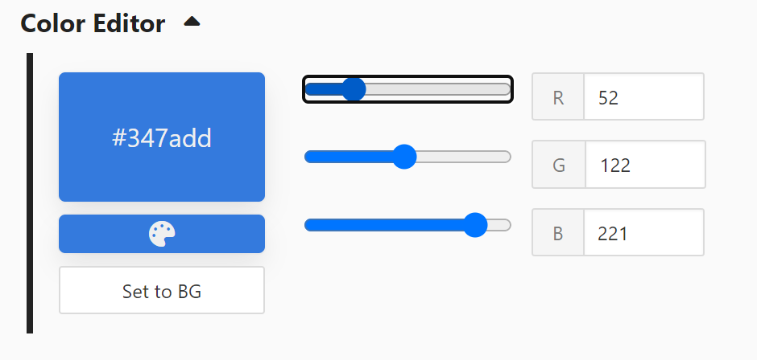

# Siv3D Palette Browser

https://voidproc.github.io/siv3d-palette-browser/

# 概要

[OpenSiv3D](https://github.com/Siv3D/OpenSiv3D) の [Palette](https://github.com/Siv3D/OpenSiv3D/blob/main/Siv3D/include/Siv3D/Palette.hpp#L23) で定義されている色を見ながらクリックしてコピペするためのツール

# 使い方

- 色のボタンをクリックすると、ボタンに表示されているテキストをコピーできます。
- 色名で絞り込み検索ができます。

- `Palette::Red` のような色名だけでなく、`Color{ 255, 0, 0 }` や `ColorF{ 1.0, 0.0, 0.0 }`、あるいは `#ff0000` といった形式でコピーすることもできます（"Control..." 内で切り替えられます）。

- RGB各成分のスライダーで細かく色を編集することができます（"Color Editor..." 内で操作できます）。

# 動作環境

以下の環境で開発・動作確認しています。

- Windows 11 22H2
- Google Chrome 110.0.5481.178
